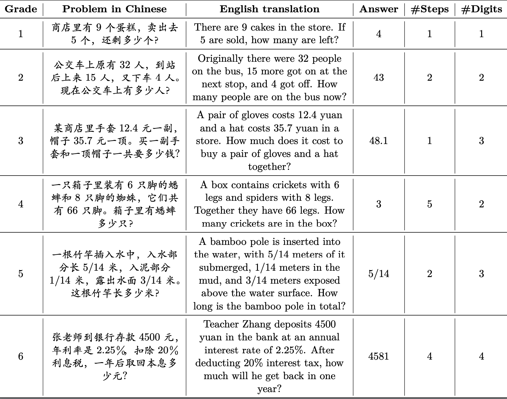
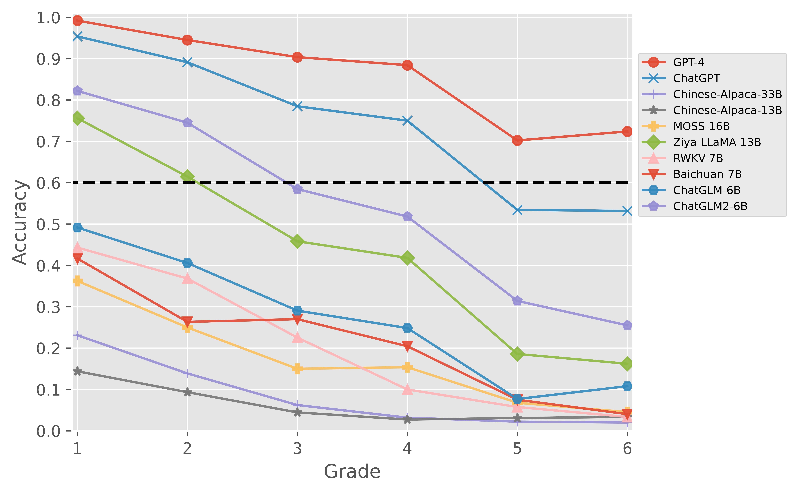
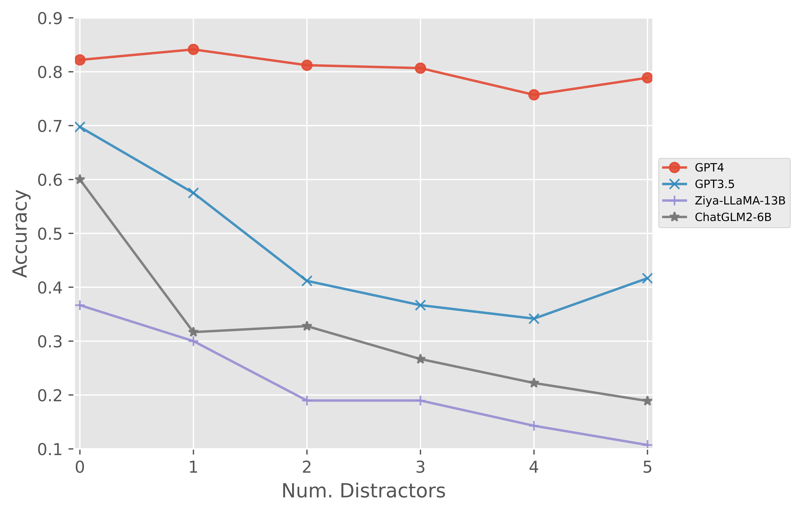

# CMATH
## 介绍
本项目中我们提出了CMATH数据集，包括1.7k个小学水平的数学应用题和详细的注释。本数据集旨在提供一个基准工具来评估以下问题：当前流行的大模型的数学能力对应小学数学几年级的水平？我们评估了各种流行的大模型，发现只有GPT-4能通过所有六个年级的数学考试(准确率>=60%)。此外，我们通过在CMATH数据集中添加干扰信息来评估大模型的稳健性。我们的研究结果表明，GPT-4是唯一保持鲁棒性的模型。

## 数据集
### cmath_dev
我们分两批开源CMATH数据集中的样本。第一批开源600条样本，每个年级100条。首次开源的样本可以视为一个dev集。剩余的样本（可以视为test集）将在年底开源。
#### 样本示例

#### 模型表现对比



### distractor
为了评估大模型面对干扰信息的稳健性，我们创建了一个小型“干扰集”，包含60条样本。每条样本中包含1个原始问题，以及5个由我们手工添加干扰信息后的“增广问题”，共6个问题。
#### 样本示例

#### 模型表现对比



## 代码
我们提供了一个脚本`eval.py`用于对模型生成的回复进行自动化的评估。

## 开源协议
* MIT license
* BSD license

## 引用我们
```
@misc{wei2023cmath,
      title={CMATH: Can Your Language Model Pass Chinese Elementary School Math Test?}, 
      author={Tianwen Wei and Jian Luan and Wei Liu and Shuang Dong and Bin Wang},
      year={2023},
      eprint={2306.16636},
      archivePrefix={arXiv},
      primaryClass={cs.CL}
}
```