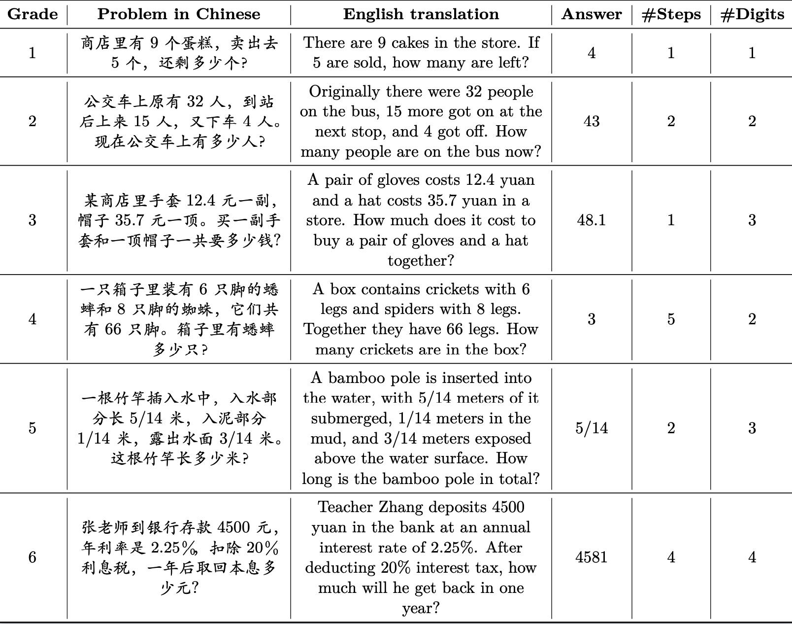
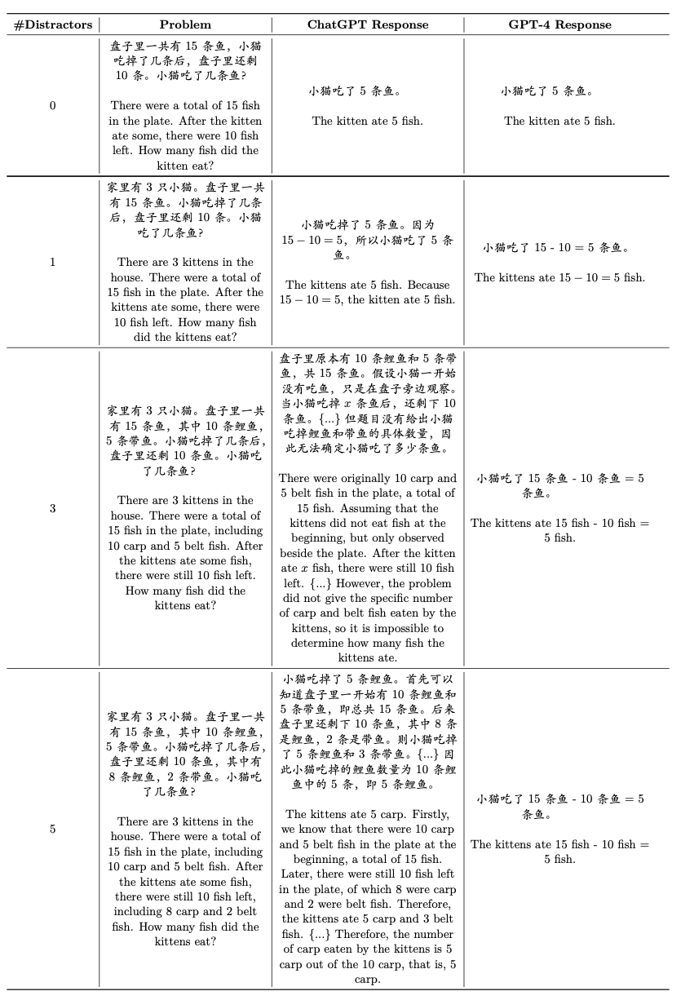

# CMATH
## Introduction
We present the Chinese Elementary School Math Word Problems (CMATH) dataset, comprising 1.7k elementary school-level math word problems with detailed annotations, source from actual Chinese workbooks and exams. This dataset aims to provide a benchmark tool for assessing the following question: to what grade level of elementary school math do the abilities of popular large language models (LLMs) correspond? We evaluate a variety of popular LLMs, including both commercial and open-source options, and discover that only GPT-4 achieves success (accuracy >= 60%) across all six elementary school grades, while other models falter at different grade levels.
Furthermore, we assess the robustness of LLMs by augmenting the original problems in the CMATH dataset with distracting information. Our findings reveal that GPT-4 is the sole model that maintains robustness, further distinguishing its performance from competing models. We anticipate that our CMATH dataset will expose limitations in LLMs' capabilities and promote their ongoing development and advancement.

## Datasets
### cmath_dev
Initial release of 600 examples from CMATH dataset, with 100 problems from each elementary school grade.  
We will release the remaining portion of the dataset by the end of the year.
#### Examples and Annotations


#### Evaluation Results


### distractor
To assess the robustness of LLMs against "irrelevant" information, we manually created a small ``distractor dataset'' comprising 60 examples, 10 for each grade level. Each example consists of an original problem and five associated problems augmented with 1 ~ 5 piece(s) of irrelevant information which we refer to as distractor(s). 

#### Examples


#### Evaluation Results


## Script
We provide a script `eval.py` that implements automated evaluation.

## License
MIT license

## Citation
```
@misc{wei2023cmath,
      title={CMATH: Can Your Language Model Pass Chinese Elementary School Math Test?}, 
      author={Tianwen Wei and Jian Luan and Wei Liu and Shuang Dong and Bin Wang},
      year={2023},
      eprint={2306.16636},
      archivePrefix={arXiv},
      primaryClass={cs.CL}
}
```